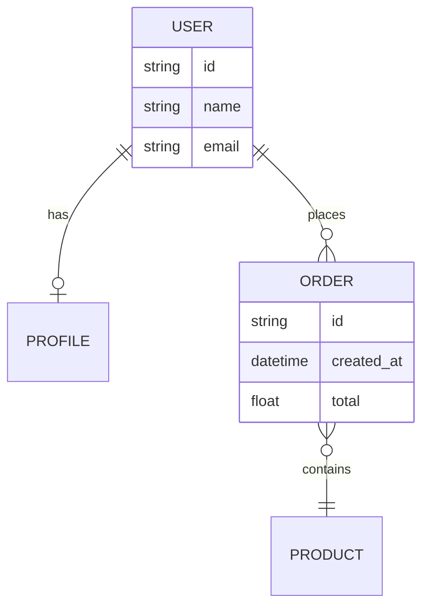
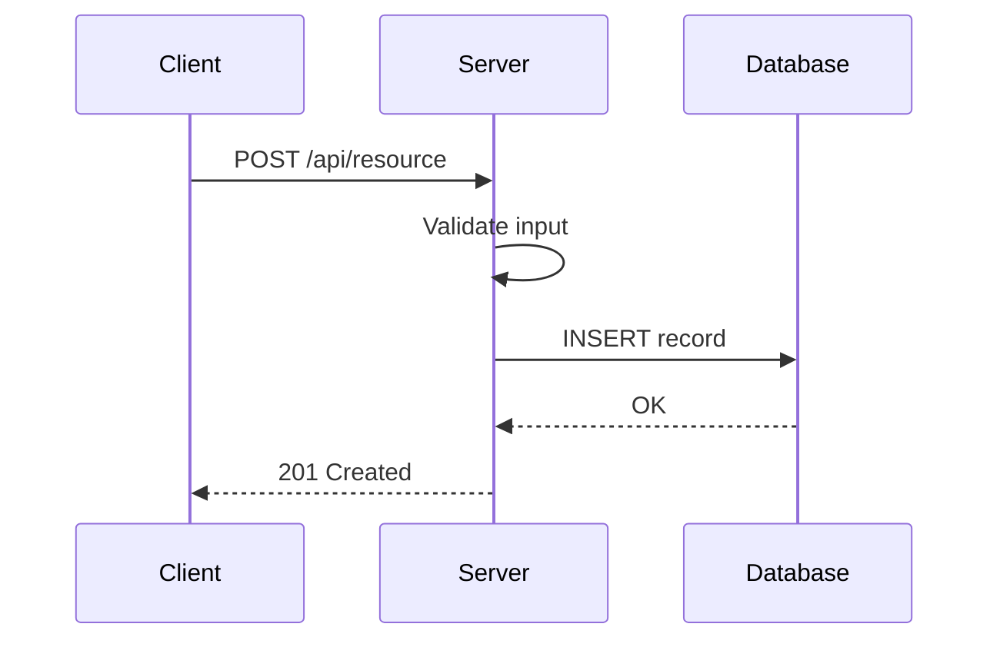
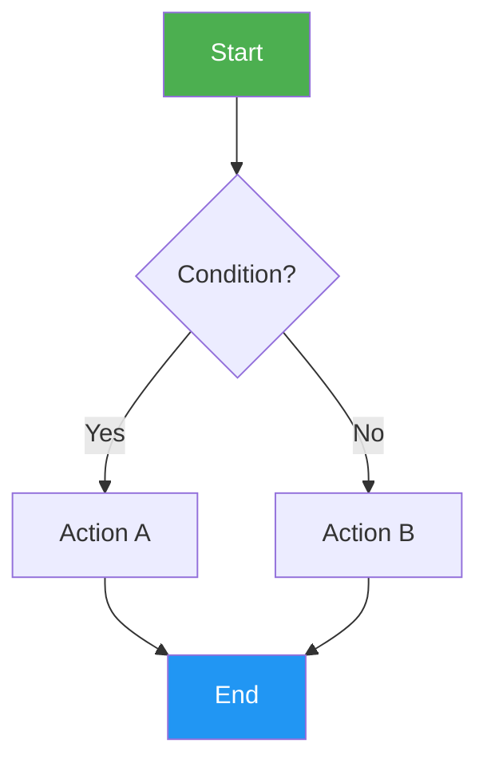
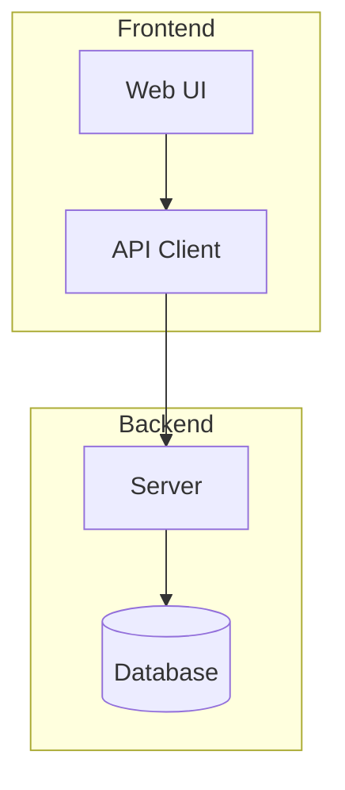
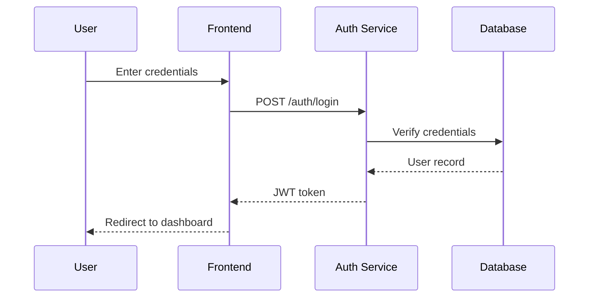

# mdBook + Mermaid Documentation

Create and maintain project documentation using mdBook with Mermaid diagrams.

## When to Use

- Add, edit, or reorganize documentation pages
- Create architecture, sequence, or ER diagrams
- Set up a new mdBook project from scratch
- Update SUMMARY.md or fix broken navigation
- Add Mermaid diagrams to existing pages
- Fix broken links or build errors

## Steps

1. Identify what the user needs: new page, new diagram, structural change, or project setup
2. Check if the target page or SUMMARY.md entry already exists — skip creation if so
3. Create the markdown file in the appropriate `src/` subdirectory
4. Add the page entry to `SUMMARY.md` at the correct nesting level
5. Write Mermaid diagrams inside fenced code blocks with the `mermaid` language tag
6. Run `mdbook build` to verify the book compiles without errors
7. Verify all internal links resolve and diagrams render

## Setup

```bash
cargo install mdbook
cargo install mdbook-mermaid

# New project
mdbook init my-docs
cd my-docs

# Add Mermaid support to book.toml
# [preprocessor.mermaid]
# command = "mdbook-mermaid"

mdbook build              # Build the book
mdbook serve              # Dev server with hot reload
```

## book.toml

```toml
[book]
title = "Project Documentation"
authors = ["Author Name"]
language = "en"
src = "src"

[preprocessor.mermaid]
command = "mdbook-mermaid"

[output.html]
additional-css = ["custom.css"]
```

## SUMMARY.md Structure

```markdown
# Summary

- [Introduction](introduction.md)

# Architecture
- [System Overview](architecture/overview.md)
- [Data Model](architecture/data-model.md)

# Getting Started
- [Prerequisites](getting-started/prerequisites.md)
- [Quick Start](getting-started/quick-start.md)

# Reference
- [API](reference/api.md)
- [Configuration](reference/config.md)

# Design Decisions
- [Why Technology X](decisions/why-x.md)
```

**Rules:**
- Part headers (`#`) create section dividers
- Every listed page must have a corresponding file — mdBook fails on missing files
- Indentation creates nested sub-chapters
- All paths relative to `src/`

## Mermaid Diagram Patterns

### Entity Relationship

````markdown

````

### Sequence Diagram

````markdown

````

### Flowchart

````markdown

````

### Architecture Overview

````markdown

````

## Writing Tone

- **Introduction:** What the project is, who it serves, what it demonstrates
- **Architecture:** Technical decisions with diagrams; explain the "why"
- **Getting Started:** Step-by-step, copy-pasteable commands
- **Reference:** Tables and lists — concise, scannable
- **Decisions:** Short essays (200-400 words) explaining engineering tradeoffs

## Decision Page Template

```markdown
# Why [Technology]

## Context
What problem needed solving.

## Options Considered
Brief list of alternatives.

## Decision
What was chosen and why.

## Tradeoffs
What was gained and what was sacrificed.

## References
Links to relevant docs/resources.
```

## Troubleshooting

| Error | Cause | Fix |
|-------|-------|-----|
| `Error: "foo.md" not found` | SUMMARY.md references a file that doesn't exist | Create the missing file or remove the SUMMARY.md entry |
| `preprocessor.mermaid: command not found` | mdbook-mermaid not installed | Run `cargo install mdbook-mermaid` |
| Mermaid diagram renders as raw text | Missing `[preprocessor.mermaid]` in book.toml | Add the preprocessor config block |
| Blank page in sidebar | File exists but is empty | Add content — mdBook renders empty files as blank pages |
| `{{#include}}` shows literal text | Path is wrong or file missing | Check the relative path from the including file |

## Constraints

- Never create empty stub pages — every page in SUMMARY.md must have real content
- Never use absolute file paths in SUMMARY.md — all paths relative to `src/`
- Never add pages to SUMMARY.md without creating the corresponding file
- Always run `mdbook build` after changes to verify compilation
- Always check that Mermaid diagrams render via `mdbook serve`
- Keep Mermaid diagrams under 30 nodes — split larger diagrams
- If the project uses `{{#include}}`, never duplicate that content into `src/`
- Check if page and SUMMARY.md entry exist before creating — avoid duplicates

## Examples

### Input
"Add a new architecture page with a sequence diagram showing the login flow"

### Output
1. Check if `src/architecture/login-flow.md` and its SUMMARY.md entry exist
2. Create `src/architecture/login-flow.md`:
```markdown
# Login Flow

How users authenticate with the system.



## Error Cases

| Scenario | Response |
|---|---|
| Invalid credentials | 401 with retry prompt |
| Account locked | 403 with support link |
```
3. Add `- [Login Flow](architecture/login-flow.md)` to SUMMARY.md under Architecture
4. Run `mdbook build` to verify

### Input
"Fix the broken link on the getting started page"

### Output
1. Run `mdbook build` to identify the broken link from error output
2. Check SUMMARY.md for mismatched paths
3. Fix the path in either the markdown file or SUMMARY.md
4. Run `mdbook build` again to confirm resolution
