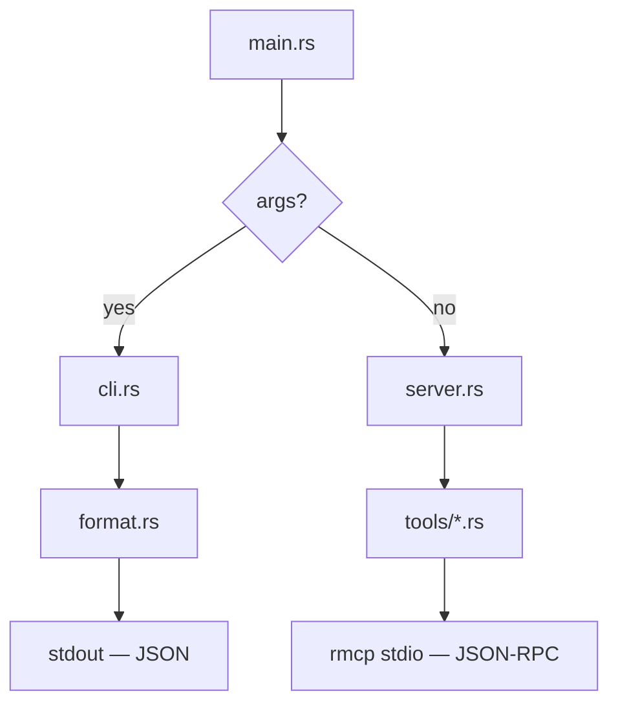
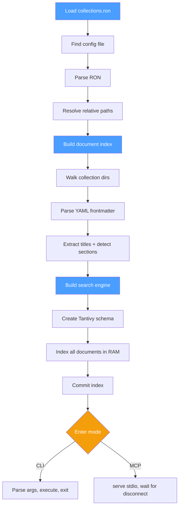
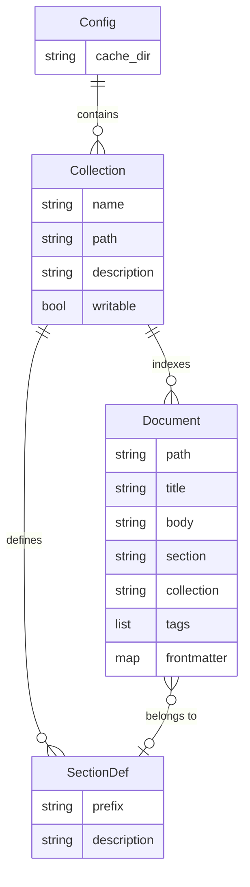
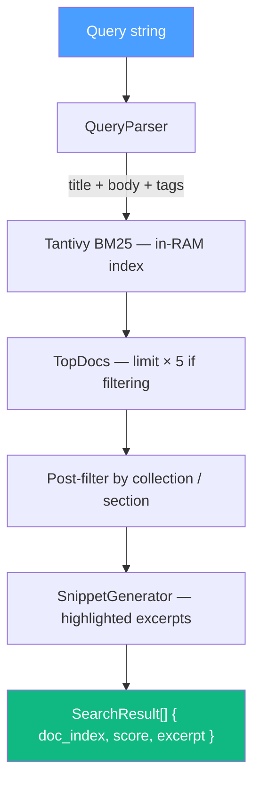
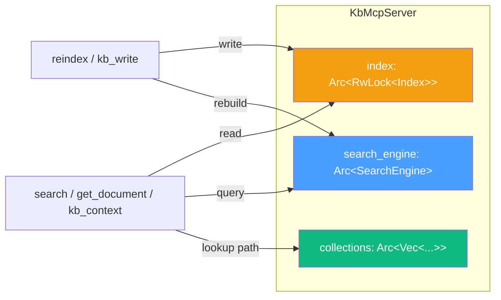
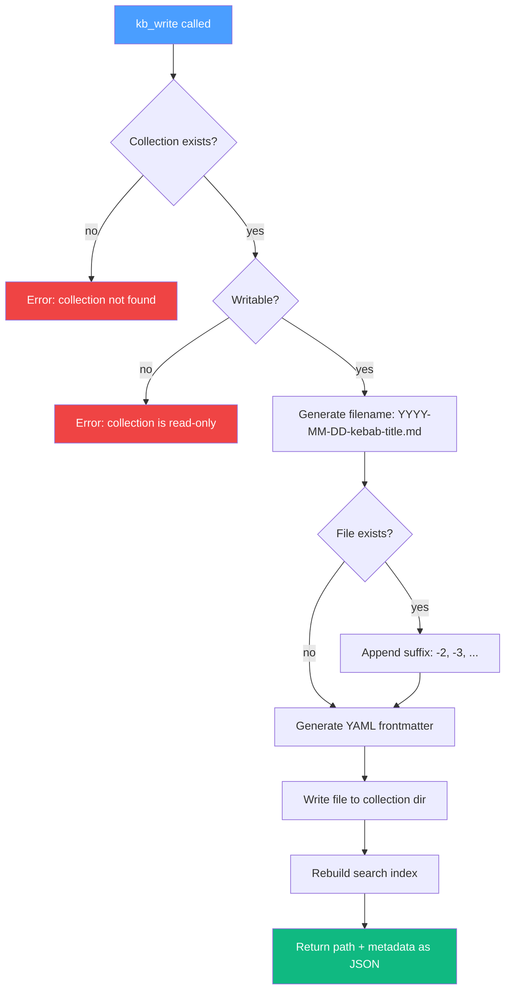

# Architecture

## Overview

kb-mcp is a single Rust binary that operates in two modes:

- **MCP Server** (no args) — stdio JSON-RPC transport via rmcp
- **CLI** (with args) — Clap subcommands, JSON to stdout

Both modes share the same config loading, indexing, search, and formatting
code. The only difference is the transport layer.



## Startup Sequence



## Module Map

```
src/
├── main.rs          Entry point — mode detection, startup orchestration
├── config.rs        RON config loading, path resolution, discovery chain
├── types.rs         Core data types (Document, Section)
├── index.rs         Filesystem scanning, frontmatter parsing, section building
├── search.rs        Tantivy BM25 index — build, search, rebuild
├── format.rs        JSON output structs and serialization helpers
├── cli.rs           Clap parser and CLI command dispatch
├── server.rs        KbMcpServer struct, ServerHandler impl, fresh-read helper
└── tools/
    ├── mod.rs       Router composition (sections + documents + search + ...)
    ├── sections.rs  list_sections — collection/section inventory
    ├── documents.rs get_document — full content retrieval (fresh from disk)
    ├── search.rs    search — BM25 full-text with collection/section filtering
    ├── context.rs   kb_context — frontmatter + summary (token-efficient)
    ├── write.rs     kb_write — create files in writable collections
    └── reindex.rs   reindex — rebuild index from disk
```

## Data Model



```
collections.ron
  └── Collection[]
        ├── name: String          unique identifier
        ├── path: String          directory (relative to config)
        ├── description: String   shown in list_sections
        ├── writable: bool        enables kb_write
        └── sections: SectionDef[]
              ├── prefix: String      matches first subdirectory
              └── description: String shown in list_sections

Document (in-memory, from scanning)
  ├── path: String            relative to collection root
  ├── title: String           from H1 heading or filename
  ├── tags: Vec<String>       from YAML frontmatter
  ├── body: String            content without frontmatter
  ├── section: String         first directory component
  ├── collection: String      owning collection name
  └── frontmatter: HashMap    all YAML fields (for kb_context)

Section (derived)
  ├── name: String            directory prefix
  ├── description: String     from RON config (or empty)
  ├── doc_count: usize        documents in this section
  └── collection: String      owning collection name
```

## Config Resolution

The config discovery chain runs in order, first match wins:

```
1. --config <path>                    explicit CLI flag
2. $KB_MCP_CONFIG                     environment variable
3. ./collections.ron                  current working directory
4. ~/.config/kb-mcp/collections.ron   user default
```

Collection paths in the RON file resolve relative to the config file's
parent directory. This means the same binary works from any working
directory as long as the config paths are correct relative to the config.

## Search Architecture



The search index is built in RAM on startup. It contains all documents
from all collections. Filtering by collection or section happens
post-query because Tantivy's STRING fields support exact match but not
efficient pre-filtering in a single query. The 5× over-fetch compensates
for post-filter reduction.

## Tool Pattern

Each tool follows an identical structure:

```rust
// 1. Params struct — derives Deserialize + JsonSchema
#[derive(Deserialize, JsonSchema)]
pub struct MyParams { ... }

// 2. Router function — returns ToolRouter<KbMcpServer>
pub(crate) fn router() -> ToolRouter<KbMcpServer> {
    KbMcpServer::my_router()
}

// 3. Tool implementation — #[rmcp::tool] on an impl block
#[rmcp::tool_router(router = my_router)]
impl KbMcpServer {
    #[rmcp::tool(name = "my_tool", description = "...")]
    pub(crate) async fn my_tool(
        &self,
        Parameters(params): Parameters<MyParams>,
    ) -> Result<CallToolResult, rmcp::ErrorData> { ... }
}
```

Routers are composed in `tools/mod.rs` using the `+` operator:

```rust
sections::router() + documents::router() + search::router() + ...
```

Adding a tool = one new file + one line in `mod.rs` + one CLI subcommand.

## State Management



- `Index` behind `RwLock` for metadata reads (most tools) with exclusive
  writes during reindex/kb_write.
- `SearchEngine` holds per-collection `Memvid` handles behind an internal
  `Mutex`. Search requires `&mut self` on Memvid even for reads.
- `get_document` reads fresh from disk via `server.rs::read_fresh()` — the
  index is only used for path/title lookup, not content serving. Edits are
  visible immediately without reindex.
- `kb_write` creates the file, syncs the collection's `.mv2`, and rebuilds
  the in-memory `Index`.

## Fresh-Read Design

`get_document` does **not** return content from the search index. It:

1. Looks up the document by path or title in the index
2. Finds the owning collection's resolved path
3. Reads the file fresh from disk
4. Strips frontmatter and returns the body

This ensures content is never stale. The tradeoff is one filesystem read
per `get_document` call, which is negligible for the expected workload.

## Write Path

`kb_write` creates files in writable collections:



## Persistent Storage (memvid-core)

Search is backed by memvid-core's `.mv2` persistent storage. Each
collection gets its own `.mv2` file at `<cache_dir>/<hash>-<name>.mv2`.

- **Startup:** opens existing `.mv2` files, diffs content hashes against
  a sidecar `.hashes` file, and only re-ingests changed documents
- **Smart chunking:** memvid-core's structural chunker segments long
  documents so queries match specific sections, not entire files
- **Crash-safe WAL:** writes go through a write-ahead log inside the `.mv2`
- **Deduplication:** search results are deduplicated by URI — one result
  per document, highest-scoring chunk wins

The `Index` (Vec<Document>) continues to handle metadata operations
(exact path lookup, frontmatter retrieval, section counting). Memvid is
the search layer only — this two-layer design keeps the architecture
simple while gaining persistent, incremental search.

## Future: Vector Search

Enable memvid-core's `vec` feature for HNSW vector similarity alongside
BM25. This would add local ONNX embeddings and hybrid ranking via RRF
fusion. The `.mv2` file format already supports vector indexes — the
change is a feature flag and a new search mode.
